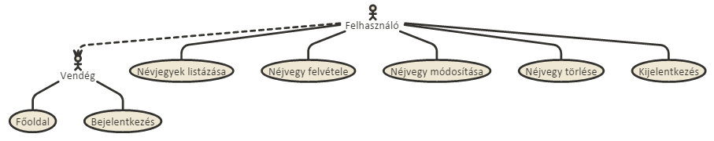
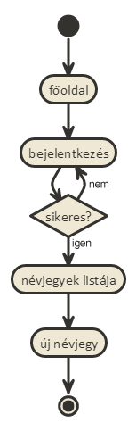
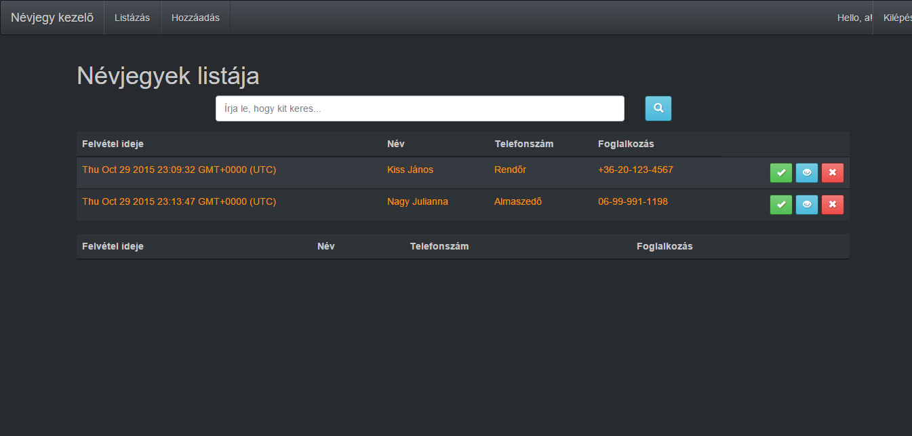
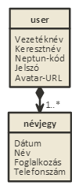
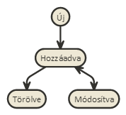

# Névjegykezelő

## Követelményanalízis

### Funkcionális elvárások
**A programnak tartalmaznia kell:**

•	legalább két modellt, egy-sok kapcsolatban

•	legalább 1 űrlapot

•	legalább 1 listázó oldalt

•	legyen lehetőség új felvételére

•	legyen lehetőség meglévő szerkesztésére

•	legyen lehetőség meglévő törlésére

•	legyenek benne csak hitelesítés után elérhető funkciók

### Nem funkcionális követelmények
•	perzisztálás fájlba történjen
•	közzététel Herokun

### Szerepkörök
•	Vendég: a főoldal tartalmához fér hozzá, rögzíteni nem tud.
•	Felhasználó: Egy vendég regisztrálás után felhasználóvá válik, így bejelentkezés után listáztatni tudja a névjegyeit, majd ezeket módosítani, törölni, esetleg újat létrehozni.

## Tervezés

### Architektúra terv
Oldaltérkép
  Publikus:
  •	Főoldal
  •	Bejelentkezés
  Felhasználó:
  •	Főoldal
  •	Bejelentkezés/Kijelentkezés
  •	Névjegylista
    +	új névjegy
    +	névjegy módosítása
    +	névjegy törlése

Végpontok
•	GET /: főoldal
•	GET /login/login: bejelentkező oldal
•	POST /login/login: bejelentkezési adatok felküldése
•	GET /login/signup: regisztrációs oldal
•	POST /login/signup: regisztrációs adatok felküldése
•	GET /list: névjegylista oldal
•	GET /add: új névjegy hozzáadása
•	POST /add: új névjegy hozzáadása, adatok küldése
•	GET /nevjegy/{id}: névjegy módosítása
•	POST /nevjegy/{id}: névjegy módosítása, adatok küldése

### Felhasználói felület:

### Osztálymodell
  Adatmodell
    
  Állapotdiagram
    

## Implementáció

### Fejlesztői környezet:
Az alkalmazást a Cloud 9 online fejlesztői környezetében, NodeJS-ben készült.

### Könyvtárstruktúrában lévő mappák
•	docs/images: A dokumentációhoz szükséges képeket tartalmazza
•	models: A user és a névjegy egyedek modelljeit tartalmazza
•	node_modules: A programhoz szükséges telepített elemeket tartalmazza
•	publis: Minden oldalhoz használható kódokat tartalmaz
•	test: Teszteseketek tartalmazza
•	views/login: Bejelentkezéshez és regisztrációhoz szükséges fájlokat tartalmazza
•	views/partials: A felület alap (állandó) építőelemeit tartalmazza
•	views: Egyéb funkciókhoz szükséges hbs fájlokat tartalmaz

## Tesztelés

A tesztesetek a "test" mappában lévő "create.test.js" fájlban találhatóak.
Ez demonstrálja, hogy egy felhasználó a regisztráció után:
•	visszanyerhető-e minden adat és ezek megegyeznek-e a regisztrációnál megadottakkal.
•	az adatbázisban bármikor megtalálhatóak és visszanyerhetőek-e a letárolt adatok
•	rossz adatoknál hibát dob-e az oldal
•	jó jelszó megadása esetén enged-e belépni az oldal
•	rossz jelszó megadása esetén hibát jelez-e az oldal

## Felhasználói dokumentáció
### Menü
•	"Névjegy kezelő" : Ide kattintva a főoldalra navigálunk át.
•	"Listázás" : Csak bejelentkezett felhasználók számára elérhető. Ide kattintva láthatjuk a névjegyek listáját.
•	"Hozzáadás" : Csak bejelentkezett felhasználók számára elérhető. Itt adhatunk a listához új névjegyet.
•	"Regisztráció" : Akik még nem felhasználók, itt regisztrálhatnak.
•	"Bejelentkezés" : Akik már regisztráltak, itt bejelentkezhetnek.
•	"Kilépés" : A már bejelentkezett felhasználók erre kattintva kijelentkezhetnek.

### Regisztráció
A regisztrációhoz szükség van a felhasználó alábbi adataira:
•	Vezetéknév (kötelező)
•	Keresztnév (kötelező)
•	Neptun-kód (kötelező)
•	Jelszó (kötelező)
•	Avatar URL (nem kötelező)

Hiányos adatok megadása esetén hibát jelez az oldal!
A helyes kitöltést követően a "Submit" gombra kattintva elvégezhető a regisztráció.
A "Cancel" gombot használva törölhető az összes eddigi kitöltött mező.

### Bejelentkezés
Itt lehet bejelentkezni a már regisztrált felhasználóknak az alábbi adatokkal:
•	Neptun-kód
•	Jelszó

Hiányos vagy hibás adaok esetén hibát jelez az oldal!
Helyes adatok megadása után a "Submit" gombra kattintva bejelentkezhetünk.
A "Cancel" gombot használva törölhető az összes eddigi kitöltött mező.

### Listázás
Bejelentkezés után itt jelennek meg a névjegyek az alábbi adataikkal:
•	Felvétel ideje
•	Név
• Foglalkozás
•	Telefonszám
•	Műveletek

Az oldal két táblázatból áll.
A fontosabb névjegyeket a zöld pipára kattintva ki lehet jelölni. Ekkor a névjegy az alsó táblázatban fog megjelenni.
Az új, illetve módosított névjegyek a felső táblázatba kerülnek.
A kék gombbal módosíthatunk egy névjegyet.
A piros gombbal törölhetünk egy névjegyet.

### Hozzáadás
Bejelentkezés után itt adhatunk hozzá új névjegyet az alábbi adatok megadásával:
•	Név
• Foglalkozás
•	Telefonszám

Hiányos adatok megadása esetén hibát jelez az oldal!
Az adatok megadása után a "Hozzáadás" gombra kattintva felvehetjünk az új névjegyünket.
A "Mégse" gombra kattintva törölhető az összes eddigi kitöltött mező.
